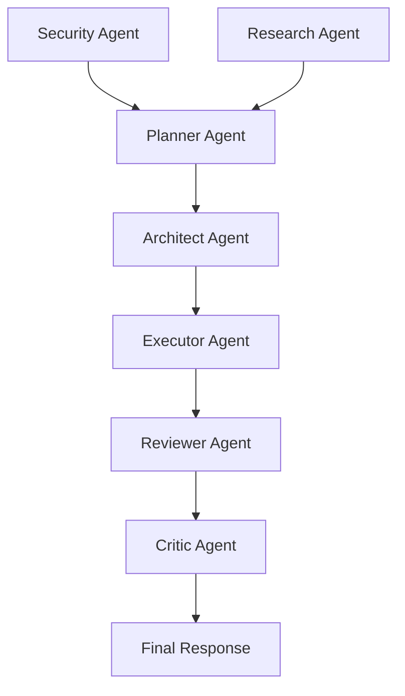

# AGENT_DEPENDENCY_GRAPH.md

## Đồ thị phụ thuộc của các loại Agent



- **Planner**: lên kế hoạch tổng thể cho nhiệm vụ.
- **Research**: thu thập tài liệu, tạo bản tóm tắt nghiên cứu.
- **Architect**: thiết kế kiến trúc giải pháp dựa trên kế hoạch.
- **Executor**: thực thi các bước kỹ thuật.
- **Security**: kiểm tra các rủi ro bảo mật và hàm lượng thông tin nhạy cảm.
- **Reviewer**: đánh giá lại kết quả, kiểm tra tính đúng đắn.
- **Critic**: phát hiện hallucination, đưa ra phản biện cuối cùng.
- **Final**: phản hồi cho người dùng.

### Quy tắc thực thi
1. **Không thực thi** downstream nếu bất kỳ node nào trong chuỗi phụ thuộc báo lỗi.
2. Khi một node **thất bại**, hệ thống tự động kích hoạt **fallback agent** (nếu có) và ghi lại trong log `agent_dependency.log`.
3. Đồ thị được lưu trữ ở `.agent/registry/agent_dependency_graph.json` để hệ thống runtime có thể load nhanh.
```
{
  "Planner": ["Architect"],
  "Research": ["Planner"],
  "Architect": ["Executor"],
  "Executor": ["Reviewer"],
  "Reviewer": ["Critic"],
  "Critic": ["Final"]
}
```

### Khi nào cập nhật
- Thêm loại agent mới → cập nhật file này và chạy `refresh_dependency_graph.js`.
- Thay đổi luồng công việc → cập nhật edge trong JSON và chạy lại.

---
*File này được tham chiếu trong **AGENT_INTELLIGENCE.md** để hướng dẫn chi tiết về governance.*
