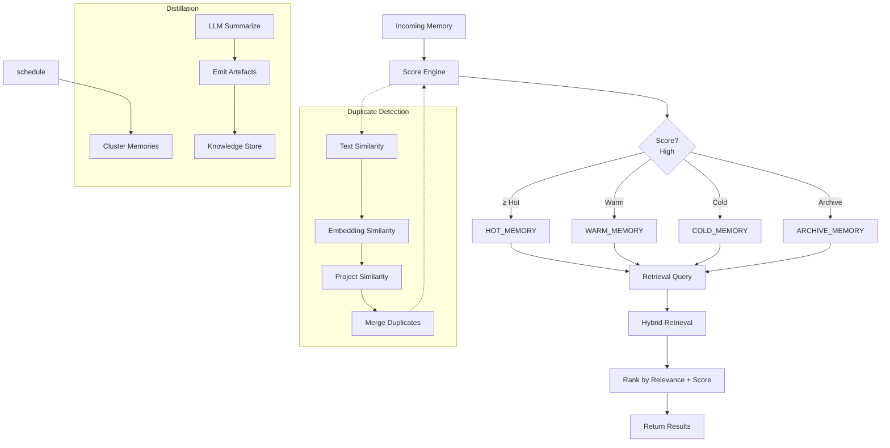

# MEMORY_INTELLIGENCE.md

## 1. Memory Scoring Engine

A **Memory Scoring Engine** computes a composite score for each stored memory entry. The score determines its lifecycle actions (retention, archival, deletion, prioritization).

```
Score =
    AccessFrequencyWeight   * AccessFrequency   +
    RecencyWeight          * RecencyFactor    +
    RelevanceWeight        * RelevanceScore   +
    SuccessImpactWeight    * SuccessImpact
```

- **AccessFrequencyWeight** – higher weight for memories accessed often.
- **RecencyWeight** – recent memories get a boost; older entries decay over time.
- **RelevanceWeight** – based on semantic relevance to current project topics (computed via embedding similarity).
- **SuccessImpactWeight** – memories that contributed to successful task outcomes (e.g., solution accepted, bug resolved) receive higher scores.

**Usage**
- **Retention** – keep memories with `Score ≥ RetentionThreshold`.
- **Archival** – move memories with `RetentionThreshold > Score ≥ ArchiveThreshold` to the warm tier.
- **Deletion** – purge memories with `Score < DeletionThreshold`.
- **Prioritization** – during retrieval, sort results descending by `Score`.

---

## 2. Semantic Duplicate Detection

Detect and merge duplicate memories using a multi‑layer similarity pipeline:

1. **Text Similarity** – token‑level Levenshtein / Jaccard similarity (≥ 0.85).
2. **Embedding Similarity** – compute vector embeddings (e.g., `text‑embedding‑ada-002`) and measure cosine similarity (≥ 0.90).
3. **Project Similarity** – ensure both memories belong to the same project context (matching `projectId` or `tag`).

When a duplicate is detected:
- Merge the metadata (combine access timestamps, increase `AccessFrequency`).
- Consolidate the `SuccessImpact` by summing the impact scores.
- Keep the most recent version of the raw text, storing older versions as historical revisions.

---

## 3. Tiered Memory Storage

| Tier | Purpose | Retention Policy |
|------|---------|------------------|
| **HOT_MEMORY** | Frequently accessed, high‑score entries. | `Score ≥ HotThreshold` (e.g., 0.75).
| **WARM_MEMORY** | Moderately used, medium‑score entries. | `HotThreshold > Score ≥ WarmThreshold` (e.g., 0.45).
| **COLD_MEMORY** | Infrequently accessed, low‑score but still valuable. | `WarmThreshold > Score ≥ ColdThreshold` (e.g., 0.20).
| **ARCHIVE_MEMORY** | Long‑term historical records, rarely needed. | `Score < ColdThreshold` → move to archive after a cooldown period (e.g., 30 days).

A background **Memory Tier Manager** runs every X minutes (configurable) to evaluate scores and migrate entries automatically.

---

## 4. Hybrid Retrieval

The retrieval engine supports multiple query modalities and ranks results with the same scoring function used for storage.

| Retrieval Mode | Description | Implementation |
|----------------|-------------|----------------|
| **Keyword Retrieval** | Classic inverted‑index lookup. | Uses `lunr.js` (or `elasticlunr`) for fast term matching.
| **Semantic Retrieval** | Embedding‑based nearest‑neighbor search. | Stores embeddings in a Faiss‑like in‑memory index; query vector computed on‑the‑fly.
| **Project Retrieval** | Restricts results to a specific `projectId` or tag. | Simple filter before ranking.
| **Context Retrieval** | Retrieves memories related to the current conversational context (window of recent messages). | Context embeddings generated from the last N messages.

**Ranking** – combine relevance (keyword/semantic) with the memory `Score`. Final rank = `α * Relevance + β * Score` (configurable weights).

---

## 5. Knowledge Distillation

Periodically (configurable schedule, e.g., nightly) the system runs a **Distillation Job**:
1. **Cluster** related memories using hierarchical clustering on embeddings.
2. **Summarize** each cluster with an LLM prompt:
   > *“Summarize the key insights, decisions, and lessons from the following memories…*”
3. **Emit** three consolidated artefacts:
   - `BEST_PRACTICES.md` – distilled actionable patterns and proven techniques.
   - `LESSONS_LEARNED.md` – failures, pitfalls, and corrective actions.
   - `PROJECT_SUMMARIES.md` – high‑level overview of each project's state, milestones, and open questions.

These artefacts are stored in the **knowledge** directory and referenced by the `Project Memory` tier as **derived knowledge**, reducing raw memory growth while preserving essential information.

---

## 6. Operational Flow Diagram



---

## 7. Configuration (JSON)

```json
{
  "scoring": {
    "weights": {
      "accessFrequency": 0.3,
      "recency": 0.25,
      "relevance": 0.3,
      "successImpact": 0.15
    },
    "thresholds": {
      "hot": 0.75,
      "warm": 0.45,
      "cold": 0.20,
      "archive": 0.10
    }
  },
  "duplicateDetection": {
    "textSimilarity": 0.85,
    "embeddingSimilarity": 0.90
  },
  "retrieval": {
    "weights": {
      "relevance": 0.6,
      "score": 0.4
    }
  },
  "distillation": {
    "schedule": "0 2 * * *",   // nightly at 02:00
    "clusterThreshold": 0.85
  }
}
```

---

**End of MEMORY_INTELLIGENCE specification**
